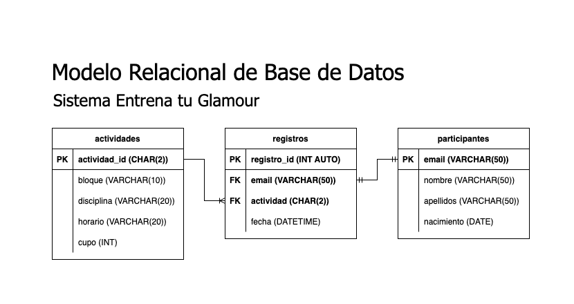

# Sistema Entrena Tu _Glamour_

## Requisitos del Sistema

- Registrar participantes para el evento Entrena tu _Glamour_.
- El evento tendrá 4 disciplinas: _KickBoxing_, Pilates, Yoga y Zumba.
- Cada disciplina tendrá 3 bloques de horarios:
  - Bloque 1 de 9:00 a 12:00
  - Bloque 2 de 14:00 a 17:00
  - Bloque 3 de 18:00 a 21:00
- Cada actividad tendrá un máximo de 10 participantes, excepto Yoga que tendrá 20.
- Cada participante sólo se podrá registrar a una sóla actividad.

## Listado de Entidades

### actividades **(EC)**

- actividad_id **(PK)**
- bloque
- disciplina
- horario
- cupo

### participantes **(ED)**

- email **(PK)**
- nombre
- apellidos
- nacimiento

### registros **(ED | EP)**

- registro_id **(PK)**
- email **(FK)**
- actividad **(FK)**
- fecha

## Relaciones

1. Un **participante** crea un **registro** (_1 - 1_).
1. Una **actividad** se asigna a un **registro** (_1 - M_).

## Diagramas

### Modelo Relacional de la BD

## Reglas de Negocio

### actividades
1. Crear una actividad
2. Leer todas las actividades
3. Actualizar una actividad
4. eliminar una actividad
5. Descontar el numero de cupos en base a los registros relacionados a la actividad **Requisito del sistema**

### participantes
1. Crear un participante
2. Actualizar info de un participante
3. eliminar un participante
4. leer todos los participantes

### registros
1. crear un registro
2. leer todos los registros
3. eliminar un registro

### Lógica y validaciones de requisitos
1. Un registro implica:
   - Validar el cupo disponible (Si es igual o menor a cero enviar alerta)
   - Descontar en uno el atributo cupos de la actividad registrada (entidad actividades)
   - Insertar la info proporcionada en registros(entidades participantes y registros)
   - Leer toda la informacion proporcionada de registros
2. Una cancelancion de registro implica
   - Sumar uno al atributo cupos de la actividad registrada (entidad activiades)
   - Eliminar el registro especifico (entidades registros y participantes)
