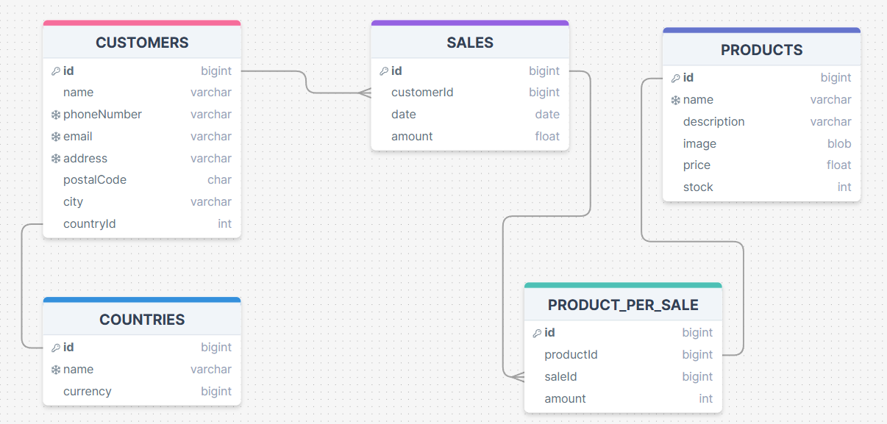

# Ventas Online

## Entidades

### CUSTOMERS (ED)
- id **(PK)**
- name
- phoneNumber **(UQ)**
- email **(UQ)**
- address 
- postalCode
- city
- countryId **(FK)**
  
### PRODUCTS (ED | EC)
- id **(PK)**
- name **(UQ)**
- description
- image
- price
- stock

### SALES (ED)
- id **(PK)**
- clienteId **(FK)**
- fecha
- monto

### COUNTRIES (EC)
- id **(PK)**
- nombre **(UQ)**
- moneda

### Tipo de Producto (EC)
### Metodo de Pago (EC)
### Promociones (EC)

### productos_por_venta (EP)
- id **(PK)**
- productId **(FK)**
- saleId **(FK)**
- amount

### Factura (EP)

## Relaciones
Un **cliente** pertenece **pais** (1 - 1)
Un **cliente** efectua **ventas** (1 - M)
Una **venta** posee **producto_por_venta** (1 - M)
Un **producto_por_venta** es **producto** (1 - 1)

## Modelo Relacional de la DB

## Reglas de Negocio

### customers
1. Crear un cliente
2. Leer todos los clientes
3. leer un cliente especifico
4. actualizar un cliente
5. eliminar un cliente

### products
1. crear un producto
2. actualizar un producto
3. eliminar un producto
4. leer todos los productos
5. leer los productos segun una categoria en particular
6. Descontar el stock segun el numero de producto comprados
7. Descontar el stock enfocado en colores

### sales
1. Crear una venta
2. leer todas las ventas
3. leer todas las ventas de un cliente en particular (Para implementar el Sistema de recompensas despues de 5 productos comprados)
4. leer todas las ventas de un producto en particular (Para los reportes y estadisticas finales)
5. actualizar una venta
6. eliminar una venta

### updates
1. crear un reporte
2. actualizar un reporte
3. eliminar un reporte
4. leer todos los reportes
5. leer los reportes por un mes especifico

### products_per_sale
1. crear un producto por venta
2. actualizar un producto por venta
3. eliminar un producto por venta
4. leer todos los productos por venta
5. leer todos productos por venta de una venta
6. leer todos los productos por venta de un cliente
7. leer los productos por venta asociados a un producto

### categories
1. crear una categoría
2. eliminar una categoria
3. actualizar una categoria
4. leer todas las categorias
5. leer una categoria en particular con sus respectivos productos (filtrado)